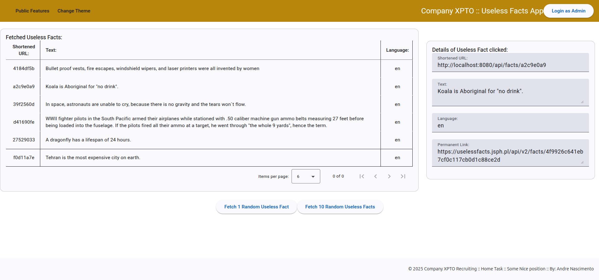
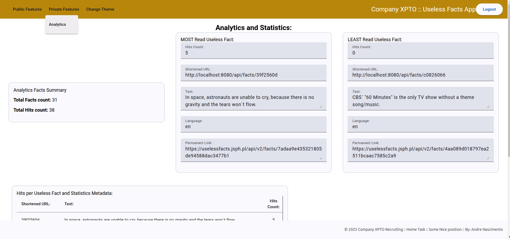
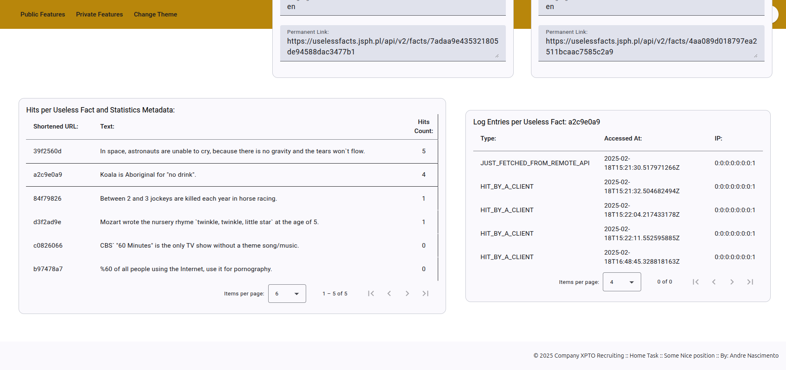
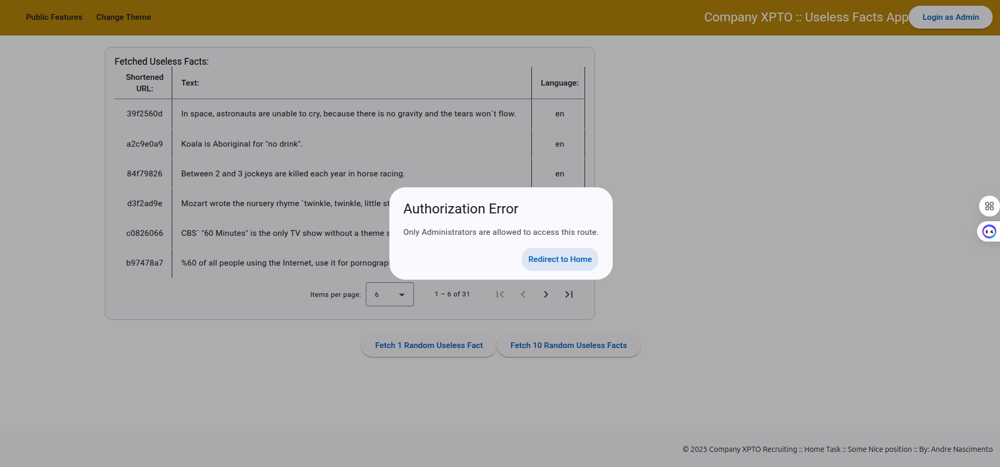

# ALNS-Deubnk-UselessFacts-Angular

## Quick Jump Into the Purpose of this Project:

This project aims to accomplish what is proposed here: [Home Task Description](./HOME-TASK-DESCRIPTION.md)

## Quick Tech Starting Point:

This project uses Quarkus, the Supersonic Subatomic Java Framework. Read more about it at: [Quarkus Framework](./HOW-TO-QUARKUS-APP.md)

# Implemented Solution Details:

## Overview

The ALNS-DeuBnk-UselessFacts Application is a full-stack solution that fetches random facts from the Useless Facts API and provides a user-friendly interface to view and manage these facts. Built with **Kotlin** and **Quarkus** for the backend and **Angular** for the frontend, this application follows the principles of **Hexagonal Architecture** and **SOLID** design principles.

### Features
- Fetch random facts from the Useless Facts API.
- In-memory caching of facts with access statistics tracking.
- Private analytics page to consult access statistics.
- Circuit breaker and fallback mechanism for resilience.
- **Swagger UI** for inspecting and testing the REST APIs.

## Architecture

The application is structured using **Hexagonal Architecture**, allowing for a clean separation of concerns and maintainability. The backend leverages Quarkus extensions for enhanced functionality, including:
- **Resilience**: Using a circuit breaker for API calls.
- **Quinoa**: Simplifies the integration of the Angular frontend with the Quarkus backend.

## How It Works

1. **Backend**:
    - Fetches random facts from the Useless Facts API.
    - Caches the facts in memory.
    - Tracks access statistics for each fact.
    - Provides RESTful endpoints for fetching facts and statistics.

2. **Frontend**:
    - Displays a button to fetch random facts and shows the result.
    - Lists cached facts with a detail view.
    - Provides a separate route for viewing access statistics.

## Security

Both the private endpoint and the analytics page are protected by a simple mechanism that requires adding and verifying a shared static value of an `API_KEY`. The manually set static value is:

    ```java 
    API_KEY = SomeMegaSecretAPI-KEY>>>w3bRTWuk61OxmCfYXYVjXdSyKYTZQBtLvRZCpixwcJKPp7VUQA5wpTlloyhPAFWdz1jQkNbvZY5wBVZZmBPVzF54a1gZmpJ8678Ewucv 
 
This approach is used for the sake of quick demonstration. Please note that the implementation of a full solution for Authentication/Authorization is out of the scope of this Code Assessment for Deutsche Bank Recruiting.

## Setup Instructions

### Prerequisites

- **JDK 17+** for Kotlin/Quarkus backend.
- **Maven 3.9.+** for building.
- **Node.js** and **npm** for Angular frontend.
- **Docker** (optional, for containerization).

### Running the Application in Development Mode

#### Backend

1. Navigate to the backend directory:
   ```bash
   cd backend

2. Build and run the Quarkus application:   
   ```bash
    ./mvnw quarkus:dev

- NOTE:
 
    - Due to the nice help of the [Quinoa Quarkus Extension](https://docs.quarkiverse.io/quarkus-quinoa/dev/config-reference.html#), the Angular Frontend app can also be compiled, run and live developed when just starting and stoping the Quarkus backend app!
    - After starting the Quarkus app via `./mvnw quarkus:dev` command, open your browser and navigate to: `http://localhost:4200` and the Frontend app is shown.
 
3. Access Swagger UI at http://localhost:8080/q/swagger-ui/ to inspect and test the REST APIs.

#### Frontend (Traditional way)

In case you don't want to rely on `Quinoa Quarkus Extension`, manage the Angular Frontend app in the traditional way, following the steps below.

1. Navigate to the frontend directory:

   ```bash
    cd frontend

2. Install dependencies:

   ```bash
    npm install

3. Start the Angular application:

   ```bash
    ng serve

4. Access the landing page at http://localhost:4200/.

### Running the Application in Production Mode

#### Backend

1. Build the Quarkus application:

   ```bash
    ./mvnw package

2. Run the application:

   ```bash
    java -jar target/*-runner.jar

3. Access Swagger UI at http://localhost:8080/q/swagger-ui/ for API documentation.

#### Frontend

1. Build the Angular application:

   ```bash
    ng build --prod

2. Serve the production build using any static server (e.g., http-server, nginx, etc.).

### Containerization with Docker

#### Build Docker Image for the backend:

   ```bash
    cd backend
    ./mvnw package -Dquarkus.container-image.build=true
   ```

#### Run Docker Container:

   ```bash
    docker run -i --rm -p 8080:8080 <your-docker-image>
   ```
#### Serve the Frontend:

You can create a Docker image for the Angular app similarly or serve it using a static server.

## API Endpoints

- Fetch Random Fact: POST /facts
- Get Cached Fact: GET /facts/{shortenedUrl}
- Get All Cached Facts: GET /facts
- Access Statistics: GET /admin/statistics

## Screenshots









## Error Handling

The application handles errors from the Useless Facts API gracefully, providing appropriate responses in case of failures.

## Testing

Unit tests are included to ensure code quality and reliability. To run tests, execute:

   ```bash
    ./mvnw test
   ```

## Conclusion
This Random Facts Application demonstrates a clean and maintainable architecture, providing a robust solution for fetching and managing random facts. Feel free to extend and modify the application as needed.

## License
[TBD]

## Notes:
- The security section has been added to clarify the API key protection mechanism for the private endpoint and analytics page.
- The statement regarding the scope of the authentication/authorization implementation has also been included.
